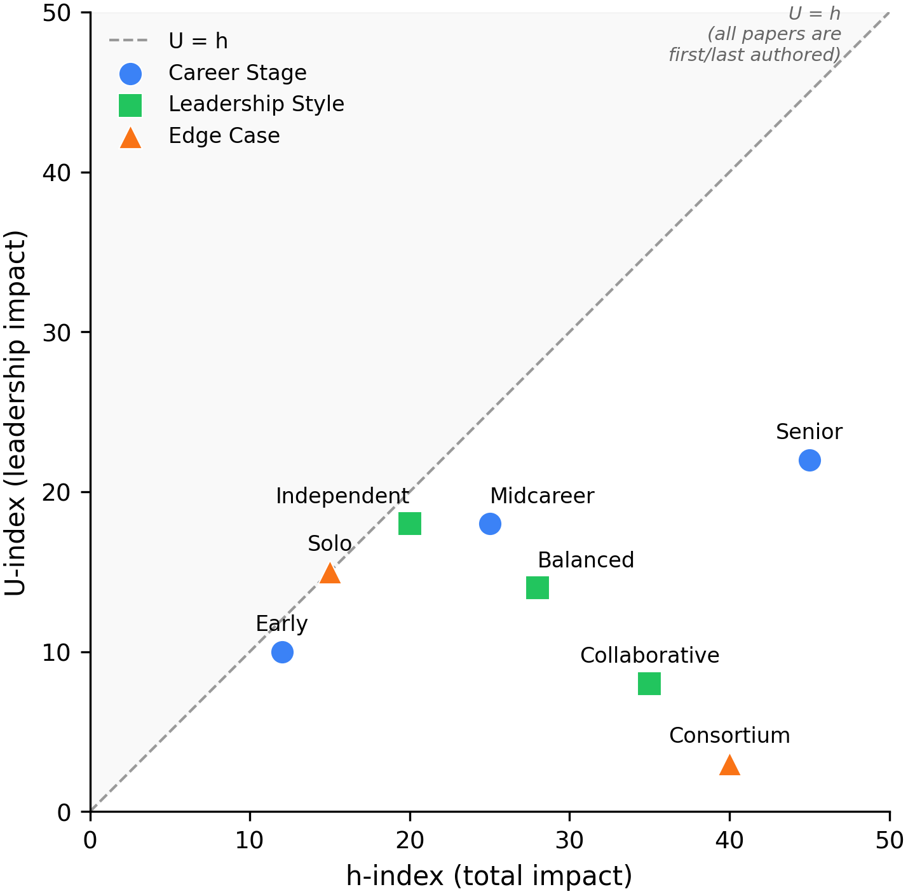

# U-Index

A CLI tool to calculate the Umeton Index (U-index), a leadership-filtered modification of the h-index.



## What is the U-index?

The U-index modifies the h-index to count only publications where a researcher is **first or last author**, isolating research leadership contributions from collaborative middle-author positions.

**Definition:** A researcher has U-index U if U of their first-or-last-authored papers have each been cited at least U times.

**Key property:** U is always less than or equal to h (U ≤ h), making it a conservative lower bound on leadership-derived impact.

## Why it matters

The h-index treats all co-authorships equally. A researcher can inflate their h-index by accumulating middle-author positions on collaborative papers without ever leading independent research.

The U-index addresses this by applying a binary filter:
- First or last author → counts toward U-index
- Middle author → does not count

The figure above shows this relationship for simulated researcher profiles:
- **Dr. Solo** (single-author theoretician): sits on the diagonal where U = h
- **Dr. Independent** (small lab PI): stays close to the diagonal (U/h = 90%)
- **Dr. Consortium** (large collaboration contributor): falls far below (U/h = 7.5%)

The vertical distance from each point to the diagonal represents impact accumulated through middle-author positions.

## Installation

Requires Python 3.14+.

```bash
git clone https://github.com/renato-umeton/u-index.git
cd u-index
pipenv install
pipenv run pip install -e .
```

## Usage

```bash
# Calculate U-index for an author (use "LastName FirstName" format for PubMed)
pipenv run uindex "Smith John"

# Skip cache (fetch fresh data)
pipenv run uindex "Smith John" --no-cache

# Force refresh cached data
pipenv run uindex "Smith John" --refresh
```

### Example Output

```
Author: Smith John
Qualifying papers (first/last author): 12

U-index: 8

Papers with citation data: 12
Unmatched (no DOI or not in OpenAlex): 0

================================================================================
QUALIFYING PAPERS (sorted by citations)
================================================================================

1. A groundbreaking study on machine learning applications...
   Year: 2019 | Position: last author | Citations: 245
   PubMed:   https://pubmed.ncbi.nlm.nih.gov/12345678/
   OpenAlex: https://openalex.org/works/https://doi.org/10.1234/example.2019.001

2. Novel approaches to data analysis...
   Year: 2020 | Position: first author | Citations: 187
   ...
```

## Interpreting Results

| Pattern | Interpretation |
|---------|----------------|
| U ≈ h | Impact concentrated in leadership positions |
| U << h | Significant impact from collaborative contributions |
| U = h | All impactful papers are first/last authored |

## Design Decisions

- **Single-author papers** qualify the author as first (and last)
- **Corresponding authorship** does not qualify (practices vary across fields)
- **Co-first/co-last authorship** intentionally excluded for strict, unambiguous criteria

## Data Sources

- **PubMed** (via E-utilities): Author publications and author position detection
- **OpenAlex**: Citation counts (matched via DOI)

## Development

```bash
pipenv install --dev     # Install all dependencies
pipenv run pytest -v     # Run tests
```

### Example Visualizations

Interactive visualizations demonstrating the U-index concept are available in the **[Jupyter notebook](examples/u_index_visualizations.ipynb)**, which renders directly on GitHub.

To generate standalone HTML files locally:
```bash
pipenv run python examples/u_index_visualizations.py
```

## Citation

If you use the U-index in your research, please cite:

> Umeton R. The Umeton index: A leadership-filtered modification of the h-index. (2025)

## License

MIT License. See [LICENSE](LICENSE) for details.

## Author

Renato Umeton - Office of Data Science, St. Jude Children's Research Hospital
